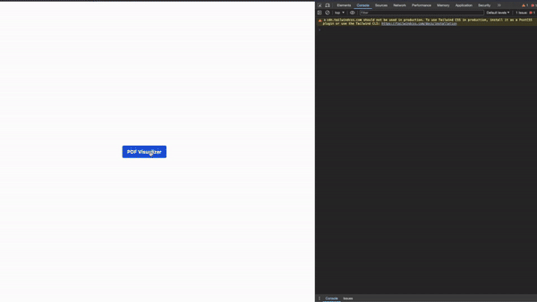

# PDFVisualizer

A modular PDF visualizer that works as a modal in various JavaScript frameworks.

## Installation

```bash
// npm install pdf-visualizer
npm install pdf-visualizer
```

```bash
// cdn link
<script src="https://cdn.jsdelivr.net/npm/pdf-visualizer@latest/dist/index.js"></script>
```

## Usage

### Vanilla JavaScript


```javascript
import pdfVisualizer from "pdf-visualizer";

// Create the PDF visualizer basically
await pdfVisualizer.init({
  url: "https://api.syssoftintegra.com/servicios/syssoft/api/reporte/facturacion/venta/pdf/a4/VT0002",
});
```



```javascript
// Create the PDF visualizer with custom styles and events
await pdfVisualizer.init({
  url: "https://api.syssoftintegra.com/servicios/syssoft/api/reporte/facturacion/venta/pdf/ticket/VT0002",
  title: "PDF Visualizer",
  titlePageNumber: "Página",
  titleLoading: "Cargando PDF...",
  styleContent: "background-color: red;",
  styleHeader: "background-color: orange;",
  styleControls: "background-color: yellow;",
  styleBody: "background-color: green;",
  styleTextTitle: "color: red; font-size: 50px;",
  styleTextPageNumber: "color: blue;",
  stylTextZoomInfo: "color: pink;",
  styleTextLoading: "color: green;",
  styleButtonClose: "color: red; padding: 6px;",
  styleButtonPrev: "color: orange;",
  styleButtonNext: "color: purple;",
  styleButtonZoomIn: "color: white;",
  styleButtonZoomOut: "color: brown;",
  styleButtonDownload: "color: black;",
  styleButtonPrint: "color: red;",
  isMoveable: true,
  isClosingOnEscape: true,
  isClosingOnClickOutside: true,
  isDownloadingOnClick: true,
  isPrintingOnClick: true,
  onAfterOpen: () => {
    console.log("PDF opened");
  },
  onBeforeOpen: () => {
    console.log("Opening PDF");
  },
  // Event execute before closing the PDF by not using the function close
  onBeforeClose: () => {
    console.log("Closing PDF");
  },
  // Event execute after closing the PDF by not using the function close
  onAfterClose: () => {
    console.log("PDF closed");
  },
  // Event execute when an error occurs
  onError: (error) => {
    console.log("Error al abrir el PDF:", error);
  },
});
```

```javascript
await pdfVisualizer.init({
  url: "https://api.syssoftintegra.com/servicios/syssoft/api/reporte/facturacion/venta/pdf/ticket/VT0002",
  title: "PDF Visualizer",
  titlePageNumber: "Página",
  titleLoading: "Cargando PDF...",
  styleContent: "background-color: red;",
  styleHeader: "background-color: orange;",
  styleControls: "background-color: yellow;",
  styleBody: "background-color: green;",
  styleTextTitle: "color: red; font-size: 50px;",
  styleTextPageNumber: "color: blue;",
  stylTextZoomInfo: "color: pink;",
  styleTextLoading: "color: green;",
  styleButtonClose: "color: red; padding: 6px;",
  styleButtonPrev: "color: orange;",
  styleButtonNext: "color: purple;",
  styleButtonZoomIn: "color: white;",
  styleButtonZoomOut: "color: brown;",
  styleButtonDownload: "color: black;",
  styleButtonPrint: "color: red;",
  isMoveable: true,
  isClosingOnEscape: true,
  isClosingOnClickOutside: true,
  isDownloadingOnClick: true,
  isPrintingOnClick: true,
  onAfterOpen: () => {
    console.log("PDF opened");
  },
  onBeforeOpen: () => {
    console.log("Opening PDF");
  },
  // Event execute before closing the PDF by not using the function close
  onBeforeClose: () => {
    console.log("Closing PDF");
  },
  // Event execute after closing the PDF by not using the function close
  onAfterClose: () => {
    console.log("PDF closed");
  },
    // Event execute when an error occurs
  onError: (error) => {
    console.log("Error al abrir el PDF:", error);
  },
});

// Close the PDF visualizer with custom events and example of timeout
setTimeout(() => {
  if (pdfVisualizer.isOpen()) {
    pdfVisualizer.close({
      onBeforeClose: () => {
        console.log("Closing 1 PDF");
      },
      onAfterClose: () => {
        console.log("PDF closed 1");
      },
    });
  }
}, 5000);

// Close the PDF visualizer with custom events
if (pdfVisualizer.isOpen()) {
  pdfVisualizer.close({
    onBeforeClose: () => {
      console.log("Closing 1 PDF");
    },
    onAfterClose: () => {
      console.log("PDF closed 1");
    },
  });
}
```

### Check if the PDF is open or closed

```javascript
if (pdfVisualizer.isOpen()) {
  console.log("PDF is open");
} else {
  console.log("PDF is closed");
}
```

### HTML

```html
<html>
  <head>
    <meta charset="UTF-8" />
    <link rel="icon" type="image/svg+xml" href="/vite.svg" />
    <meta name="viewport" content="width=device-width, initial-scale=1.0" />
    <title>Example Pdf Visualizer</title>
    <script src="https://cdn.tailwindcss.com"></script>
    <script src="https://cdn.jsdelivr.net/npm/pdf-visualizer@latest/dist/index.js"></script>
  </head>
  <body>
    <div class="flex justify-center items-center h-screen">
      <button
        id="btn-pdf-visualizer"
        class="bg-blue-500 hover:bg-blue-700 text-white font-bold py-2 px-4 rounded focus:outline-none focus:ring-2 focus:ring-red-400 focus:ring-opacity-75"
      >
        PDF Visualizer
      </button>
    </div>
    <script>
      document
        .querySelector("#btn-pdf-visualizer")
        .addEventListener("click", async () => {
          await pdfVisualizer.init({
            url: "https://api.syssoftintegra.com/servicios/syssoft/api/reporte/facturacion/venta/pdf/ticket/VT0002",
          });
        });
    </script>
  </body>
</html>
```

### React

```jsx
import React, { useEffect, useRef } from "react";
import pdfVisualizer from "pdf-visualizer";

function PDFVisualizerComponent({ url }) {
  const viewerRef = useRef(null);

  useEffect(() => {
    viewerRef.current = pdfVisualizer;

    return () => {
      if (viewerRef.current) {
        viewerRef.current.close();
      }
    };
  }, [url]);

  const openViewer = async () => {
    if (viewerRef.current) {
      await viewerRef.current.init({
        url: url,
      });
    }
  };

  return <button onClick={openViewer}>Ver PDF</button>;
}
```

### Vue

```vue
<template>
  <button @click="openViewer">Ver PDF</button>
</template>

<script>
import pdfVisualizer from "pdf-visualizer";

export default {
  props: ["url"],
  data() {
    return {
      viewer: null,
    };
  },
  mounted() {
    this.viewer = pdfVisualizer;
  },
  beforeDestroy() {
    if (this.viewer) {
      this.viewer.close();
    }
  },
  methods: {
    openViewer() {
      async if (this.viewer) {
        await this.viewer.init({
          url: this.url,
        });
      }
    },
  },
};
</script>
```

### Angular

```typescript
import { Component, OnInit, OnDestroy, Input } from "@angular/core";
import pdfVisualizer from "pdf-visualizer";

@Component({
  selector: "app-pdf-viewer",
  template: '<button (click)="openViewer()">Ver PDF</button>',
})
export class PDFVisualizerComponent implements OnInit, OnDestroy {
  @Input() url: string;
  private viewer: any;

  ngOnInit() {
    this.viewer = pdfVisualizer;
  }

  ngOnDestroy() {
    if (this.viewer) {
      this.viewer.close();
    }
  }

  async openViewer() {
    if (this.viewer) {
      await this.viewer.init({
        url: this.url,
      });
    }
  }
}
```
